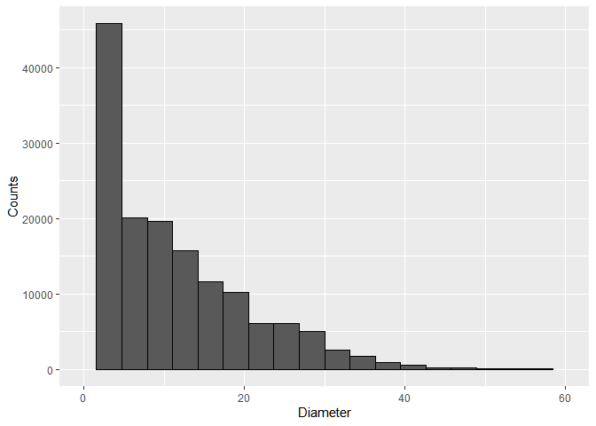
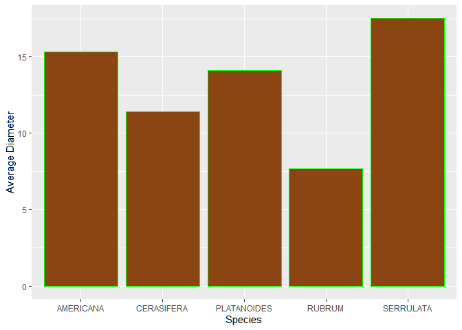
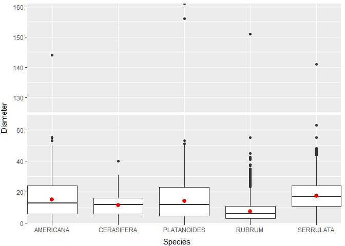
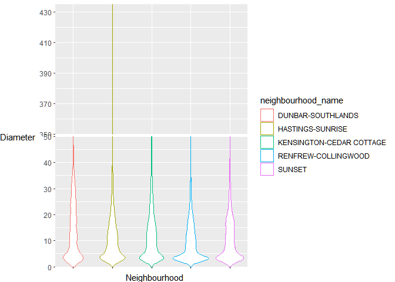

Mini Data-Analysis Deliverable 1
================
Kashish Doshi
October 9th, 2021

# Welcome to your (maybe) first-ever data analysis project!

And hopefully the first of many. Let’s get started:

1.  Install the [`datateachr`](https://github.com/UBC-MDS/datateachr)
    package by typing the following into your **R terminal**:

<!-- -->

    install.packages("ggbreak")
    install.packages("devtools")
    devtools::install_github("UBC-MDS/datateachr")

2.  Load the packages below.

``` r
suppressMessages(library(datateachr))
suppressMessages(library(tidyverse))
suppressMessages(library(tibble))
suppressMessages(library(viridis))
suppressMessages(library(ggbreak))
```

3.  Make a repository in the <https://github.com/stat545ubc-2021>
    Organization. You will be working with this repository for the
    entire data analysis project. You can either make it public, or make
    it private and add the TA’s and Vincenzo as collaborators.

4.  When you go to submit, submit a URL to your repository to canvas.

# Instructions

More details regarding the instructions and points allocated to each
task can be found below. Briefly,

-   Each milestone is worth 30 points. The number of points allocated to
    each task will be annotated within each deliverable. Tasks that are
    more challenging will often be allocated more points.

-   10 points will be allocated to the reproducibility, cleanliness, and
    coherence of the analysis. While the three milestones will be
    submitted as independent deliverables, the analysis itself is a
    continuum - think of it as 3 chapters to a story. Each chapter, or
    in this case, portion of your analysis, should be easily followed
    through by someone unfamiliar with the content.
    [Here](https://swcarpentry.github.io/r-novice-inflammation/06-best-practices-R/)
    is a good resource for what constitutes “good code”. Learning good
    coding practices early in your career will save you hassle later on!

# Learning Objectives

By the end of this milestone, you should:

-   Become familiar with your dataset of choosing
-   Think of 4 questions that you would like to answer with your data
-   Generate a reproducible and clear report using R Markdown

# Task 1: Choose your favorite dataset (10 points)

The `datateachr` package by Hayley Boyce and Jordan Bourak currently
composed of 7 semi-tidy datasets for educational purposes. Here is a
brief description of each dataset:

-   *apt\_buildings*: Acquired courtesy of The City of Toronto’s Open
    Data Portal. It currently has 3455 rows and 37 columns.

-   *building\_permits*: Acquired courtesy of The City of Vancouver’s
    Open Data Portal. It currently has 20680 rows and 14 columns.

-   *cancer\_sample*: Acquired courtesy of UCI Machine Learning
    Repository. It currently has 569 rows and 32 columns.

-   *flow\_sample*: Acquired courtesy of The Government of Canada’s
    Historical Hydrometric Database. It currently has 218 rows and 7
    columns.

-   *parking\_meters*: Acquired courtesy of The City of Vancouver’s Open
    Data Portal. It currently has 10032 rows and 22 columns.

-   *steam\_games*: Acquired courtesy of Kaggle. It currently has 40833
    rows and 21 columns.

-   *vancouver\_trees*: Acquired courtesy of The City of Vancouver’s
    Open Data Portal. It currently has 146611 rows and 20 columns.

**Things to keep in mind**

-   We hope that this project will serve as practice for carrying our
    your own *independent* data analysis. Remember to comment your code,
    be explicit about what you are doing, and write notes in this
    markdown document when you feel that context is required. As you
    advance in the project, prompts and hints to do this will be
    diminished - it’ll be up to you!

-   Before choosing a dataset, you should always keep in mind **your
    goal**, or in other ways, *what you wish to achieve with this data*.
    This mini data-analysis project focuses on *data wrangling*,
    *tidying*, and *visualization*. In short, it’s a way for you to get
    your feet wet with exploring data on your own.

And that is exactly the first thing that you will do!

1.1 Out of the 7 datasets available in the `datateachr` package, choose
**4** that appeal to you based on their description. Write your choices
below:

**Note**: We encourage you to use the ones in the `datateachr` package,
but if you have a dataset that you’d really like to use, you can include
it here. But, please check with a member of the teaching team to see
whether the dataset is of appropriate complexity. Also, include a
**brief** description of the dataset here to help the teaching team
understand your data.

1: *steam\_games*  
2: *vancouver\_trees*  
3: *parking\_meters*  
4: *cancer\_sample*

1.2 One way to narrowing down your selection is to *explore* the
datasets. Use your knowledge of dplyr to find out at least *3*
attributes about each of these datasets (an attribute is something such
as number of rows, variables, class type…). The goal here is to have an
idea of *what the data looks like*.

*Hint:* This is one of those times when you should think about the
cleanliness of your analysis. I added a single code chunk for you, but
do you want to use more than one? Would you like to write more comments
outside of the code chunk?

**To get the basic attributes of each data set I can use the *str()*
function which gives the number of rows, columns, the names of columns
and, the type of variables used.**

### Steam Games

Before working with a data set it is important to understand the types
of variables being used here.

``` r
### Steam Games ###
str(steam_games, 
    stringsAsFactors=FALSE, 
    vec.len = 3, 
    give.length= FALSE, 
    nchar.max=50)
```

    ## spec_tbl_df [40,833 x 21] (S3: spec_tbl_df/tbl_df/tbl/data.frame)
    ##  $ id                      : num  1 2 3 4 5 6 7 8 ...
    ##  $ url                     : chr  "https://store.steampowered.com/app/379720/DOOM/" "https://store.steampowered.com/ap"| __truncated__ "https://store.steampowered.com/ap"| __truncated__ ...
    ##  $ types                   : chr  "app" "app" "app" ...
    ##  $ name                    : chr  "DOOM" "PLAYERUNKNOWN'S BATTLEGROUNDS" "BATTLETECH" ...
    ##  $ desc_snippet            : chr  "Now includes all three premium DL"| __truncated__ "PLAYERUNKNOWN'S BATTLEGROUNDS is "| __truncated__ "Take command of your own mercenar"| __truncated__ ...
    ##  $ recent_reviews          : chr  "Very Positive,(554),- 89% of the "| __truncated__ "Mixed,(6,214),- 49% of the 6,214 "| __truncated__ "Mixed,(166),- 54% of the 166 user"| __truncated__ ...
    ##  $ all_reviews             : chr  "Very Positive,(42,550),- 92% of t"| __truncated__ "Mixed,(836,608),- 49% of the 836,"| __truncated__ "Mostly Positive,(7,030),- 71% of "| __truncated__ ...
    ##  $ release_date            : chr  "May 12, 2016" "Dec 21, 2017" "Apr 24, 2018" ...
    ##  $ developer               : chr  "id Software" "PUBG Corporation" "Harebrained Schemes" ...
    ##  $ publisher               : chr  "Bethesda Softworks,Bethesda Softworks" "PUBG Corporation,PUBG Corporation" "Paradox Interactive,Paradox Interactive" ...
    ##  $ popular_tags            : chr  "FPS,Gore,Action,Demons,Shooter,Fi"| __truncated__ "Survival,Shooter,Multiplayer,Batt"| __truncated__ "Mechs,Strategy,Turn-Based,Turn-Ba"| __truncated__ ...
    ##  $ game_details            : chr  "Single-player,Multi-player,Co-op,"| __truncated__ "Multi-player,Online Multi-Player,Stats" "Single-player,Multi-player,Online"| __truncated__ ...
    ##  $ languages               : chr  "English,French,Italian,German,Spa"| __truncated__ "English,Korean,Simplified Chinese"| __truncated__ "English,French,German,Russian" ...
    ##  $ achievements            : num  54 37 128 NA NA NA 51 55 ...
    ##  $ genre                   : chr  "Action" "Action,Adventure,Massively Multiplayer" "Action,Adventure,Strategy" ...
    ##  $ game_description        : chr  "About This Game Developed by id s"| __truncated__ "About This Game  PLAYERUNKNOWN'S "| __truncated__ "About This Game  From original BA"| __truncated__ ...
    ##  $ mature_content          : chr  NA "Mature Content Description  The d"| __truncated__ NA ...
    ##  $ minimum_requirements    : chr  "Minimum:,OS:,Windows 7/8.1/10 (64"| __truncated__ "Minimum:,Requires a 64-bit proces"| __truncated__ "Minimum:,Requires a 64-bit proces"| __truncated__ ...
    ##  $ recommended_requirements: chr  "Recommended:,OS:,Windows 7/8.1/10"| __truncated__ "Recommended:,Requires a 64-bit pr"| __truncated__ "Recommended:,Requires a 64-bit pr"| __truncated__ ...
    ##  $ original_price          : num  20 30 40 45 ...
    ##  $ discount_price          : num  15 NA NA NA ...

There’s one interesting column, which is the release date column which
is not numeric or date formatted, but rather long strings

``` r
steam_games %>%
  arrange(release_date) %>% 
  select(release_date) %>% 
  head(n=8)
```

    ## # A tibble: 8 x 1
    ##   release_date                       
    ##   <chr>                              
    ## 1 "(When) I'm ready!"                
    ## 2 "???"                              
    ## 3 "???"                              
    ## 4 "~2019"                            
    ## 5 "¯\\_(<U+30C4>)_/¯"                      
    ## 6 "\U0001f480 COMING SOON \U0001f480"
    ## 7 "<U+0421><U+0435><U+043D><U+0442><U+044F><U+0431><U+0440><U+044C> 2019"                    
    ## 8 "<U+05D1><U+05E7><U+05E8><U+05D5><U+05D1>"

Interestingly, some of the dates are not even dates but rather *coming
soon* or even “¯\\*(ツ)*/¯”

This means date’s will have to be edited or even changed before they can
be analyzed.This means more pre-processing will have to be done in order
for me to analyse the components of this dataset.

### Vancouver Trees

Again, first let’s see what kinds of data are present

``` r
str(vancouver_trees, 
    stringsAsFactors=FALSE, 
    vec.len = 3, 
    give.length= FALSE, 
    nchar.max=50)
```

    ## tibble [146,611 x 20] (S3: tbl_df/tbl/data.frame)
    ##  $ tree_id           : num  149556 149563 149579 149590 ...
    ##  $ civic_number      : num  494 450 4994 858 ...
    ##  $ std_street        : chr  "W 58TH AV" "W 58TH AV" "WINDSOR ST" ...
    ##  $ genus_name        : chr  "ULMUS" "ZELKOVA" "STYRAX" ...
    ##  $ species_name      : chr  "AMERICANA" "SERRATA" "JAPONICA" ...
    ##  $ cultivar_name     : chr  "BRANDON" NA NA ...
    ##  $ common_name       : chr  "BRANDON ELM" "JAPANESE ZELKOVA" "JAPANESE SNOWBELL" ...
    ##  $ assigned          : chr  "N" "N" "N" ...
    ##  $ root_barrier      : chr  "N" "N" "N" ...
    ##  $ plant_area        : chr  "N" "N" "4" ...
    ##  $ on_street_block   : num  400 400 4900 800 5000 500 4900 4900 ...
    ##  $ on_street         : chr  "W 58TH AV" "W 58TH AV" "WINDSOR ST" ...
    ##  $ neighbourhood_name: chr  "MARPOLE" "MARPOLE" "KENSINGTON-CEDAR COTTAGE" ...
    ##  $ street_side_name  : chr  "EVEN" "EVEN" "EVEN" ...
    ##  $ height_range_id   : num  2 4 3 4 2 2 3 3 ...
    ##  $ diameter          : num  10 10 4 18 9 5 15 14 ...
    ##  $ curb              : chr  "N" "N" "Y" ...
    ##  $ date_planted      : Date, format: "1999-01-13" "1996-05-31" ...
    ##  $ longitude         : num  -123 -123 -123 -123 ...
    ##  $ latitude          : num  49.2 49.2 49.2 49.2 ...

The diameter is an interesting column and could be used in multiple
plots. I would want to check how many rows are missing observations

``` r
vancouver_trees %>%
  select(diameter) %>%
  drop_na()%>%
  dim()
```

    ## [1] 146611      1

Fortunately, all the trees have this observation!

I also wanted to check if the different neighborhoods had similar number
of trees sampled in this data set

``` r
neigh_count = vancouver_trees %>% select(neighbourhood_name) %>%
  table() %>%as_tibble() 
neigh_count_sorted =neigh_count %>% 
  rename(Neighbourhood ="." , Observations = n) %>%
  arrange(desc(Observations))

print(neigh_count_sorted, n=1e2)
```

    ## # A tibble: 22 x 2
    ##    Neighbourhood            Observations
    ##    <chr>                           <int>
    ##  1 RENFREW-COLLINGWOOD             11386
    ##  2 KENSINGTON-CEDAR COTTAGE        11042
    ##  3 HASTINGS-SUNRISE                10547
    ##  4 DUNBAR-SOUTHLANDS                9415
    ##  5 SUNSET                           8367
    ##  6 KITSILANO                        8115
    ##  7 VICTORIA-FRASERVIEW              7789
    ##  8 SHAUGHNESSY                      7009
    ##  9 KERRISDALE                       6936
    ## 10 RILEY PARK                       6870
    ## 11 GRANDVIEW-WOODLAND               6703
    ## 12 MARPOLE                          6353
    ## 13 MOUNT PLEASANT                   6292
    ## 14 KILLARNEY                        6148
    ## 15 ARBUTUS-RIDGE                    5169
    ## 16 DOWNTOWN                         5159
    ## 17 WEST POINT GREY                  4939
    ## 18 OAKRIDGE                         4796
    ## 19 FAIRVIEW                         4002
    ## 20 WEST END                         3507
    ## 21 SOUTH CAMBIE                     3343
    ## 22 STRATHCONA                       2724

This table was sorted by the number of observations. Looks like almost
all neighborhoods have at least 4000 trees observed. This will make for
good analyses.

### Parking Meters

Again, I will look at the type of data we get from this data set

``` r
str(parking_meters, 
    stringsAsFactors=FALSE, 
    vec.len = 3, 
    give.length= FALSE, 
    nchar.max=50)
```

    ## tibble [10,032 x 22] (S3: tbl_df/tbl/data.frame)
    ##  $ meter_head    : chr  "Twin" "Pay Station" "Twin" ...
    ##  $ r_mf_9a_6p    : chr  "$2.00" "$1.00" "$1.00" ...
    ##  $ r_mf_6p_10    : chr  "$4.00" "$1.00" "$1.00" ...
    ##  $ r_sa_9a_6p    : chr  "$2.00" "$1.00" "$1.00" ...
    ##  $ r_sa_6p_10    : chr  "$4.00" "$1.00" "$1.00" ...
    ##  $ r_su_9a_6p    : chr  "$2.00" "$1.00" "$1.00" ...
    ##  $ r_su_6p_10    : chr  "$4.00" "$1.00" "$1.00" ...
    ##  $ rate_misc     : chr  NA "$ .50" NA ...
    ##  $ time_in_effect: chr  "METER IN EFFECT: 9:00 AM TO 10:00 PM" "METER IN EFFECT: 9:00 AM TO 10:00 PM" "METER IN EFFECT: 9:00 AM TO 10:00 PM" ...
    ##  $ t_mf_9a_6p    : chr  "2 Hr" "10 Hrs" "2 Hr" ...
    ##  $ t_mf_6p_10    : chr  "4 Hr" "10 Hrs" "4 Hr" ...
    ##  $ t_sa_9a_6p    : chr  "2 Hr" "10 Hrs" "2 Hr" ...
    ##  $ t_sa_6p_10    : chr  "4 Hr" "10 Hrs" "4 Hr" ...
    ##  $ t_su_9a_6p    : chr  "2 Hr" "10 Hrs" "2 Hr" ...
    ##  $ t_su_6p_10    : chr  "4 Hr" "10 Hrs" "4 Hr" ...
    ##  $ time_misc     : chr  NA "No Time Limit" NA ...
    ##  $ credit_card   : chr  "No" "Yes" "No" ...
    ##  $ pay_phone     : chr  "66890" "59916" "57042" ...
    ##  $ longitude     : num  -123 -123 -123 -123 ...
    ##  $ latitude      : num  49.3 49.3 49.3 49.3 ...
    ##  $ geo_local_area: chr  "West End" "Strathcona" "Riley Park" ...
    ##  $ meter_id      : chr  "670805" "471405" "C80145" ...

The columns have a weird name and I will have to guess what they mean I
am assuming column 2 which reads **r\_mf\_9a\_6p** means rate for 1 hour
of parking from Monday through to Friday between 9 am and 6pm.

All the rates and hours are tabulated as characters and not numbers.
Here again, I will have to extract the numeric value from the columns
prior to running any analyses. Although this data set has a lot of
information, I do not think I want to use it further since I cannot
think of a lot of questions I could ask or answer with the given
information without heavy cleaning up.

### Cancer Sample

Let’s look at what data is present here.

``` r
str(cancer_sample, 
    stringsAsFactors=FALSE,
    vec.len = 3, 
    give.length= FALSE, 
    nchar.max=50,
    give.attr=FALSE)
```

    ## spec_tbl_df [569 x 32] (S3: spec_tbl_df/tbl_df/tbl/data.frame)
    ##  $ ID                     : num  842302 842517 84300903 84348301 ...
    ##  $ diagnosis              : chr  "M" "M" "M" ...
    ##  $ radius_mean            : num  18 20.6 19.7 11.4 ...
    ##  $ texture_mean           : num  10.4 17.8 21.2 20.4 ...
    ##  $ perimeter_mean         : num  122.8 132.9 130 77.6 ...
    ##  $ area_mean              : num  1001 1326 1203 386 ...
    ##  $ smoothness_mean        : num  0.1184 0.0847 0.1096 0.1425 ...
    ##  $ compactness_mean       : num  0.2776 0.0786 0.1599 0.2839 ...
    ##  $ concavity_mean         : num  0.3001 0.0869 0.1974 0.2414 ...
    ##  $ concave_points_mean    : num  0.1471 0.0702 0.1279 0.1052 ...
    ##  $ symmetry_mean          : num  0.242 0.181 0.207 0.26 ...
    ##  $ fractal_dimension_mean : num  0.0787 0.0567 0.06 0.0974 ...
    ##  $ radius_se              : num  1.095 0.543 0.746 0.496 ...
    ##  $ texture_se             : num  0.905 0.734 0.787 1.156 ...
    ##  $ perimeter_se           : num  8.59 3.4 4.58 3.44 ...
    ##  $ area_se                : num  153.4 74.1 94 27.2 ...
    ##  $ smoothness_se          : num  0.0064 0.00522 0.00615 0.00911 ...
    ##  $ compactness_se         : num  0.049 0.0131 0.0401 0.0746 ...
    ##  $ concavity_se           : num  0.0537 0.0186 0.0383 0.0566 ...
    ##  $ concave_points_se      : num  0.0159 0.0134 0.0206 0.0187 ...
    ##  $ symmetry_se            : num  0.03 0.0139 0.0225 0.0596 ...
    ##  $ fractal_dimension_se   : num  0.00619 0.00353 0.00457 0.00921 ...
    ##  $ radius_worst           : num  25.4 25 23.6 14.9 ...
    ##  $ texture_worst          : num  17.3 23.4 25.5 26.5 ...
    ##  $ perimeter_worst        : num  184.6 158.8 152.5 98.9 ...
    ##  $ area_worst             : num  2019 1956 1709 568 ...
    ##  $ smoothness_worst       : num  0.162 0.124 0.144 0.21 ...
    ##  $ compactness_worst      : num  0.666 0.187 0.424 0.866 ...
    ##  $ concavity_worst        : num  0.712 0.242 0.45 0.687 ...
    ##  $ concave_points_worst   : num  0.265 0.186 0.243 0.258 ...
    ##  $ symmetry_worst         : num  0.46 0.275 0.361 0.664 ...
    ##  $ fractal_dimension_worst: num  0.1189 0.089 0.0876 0.173 ...

Interestingly again the column names are not informative to someone not
already familiar with oncology and even then there is no further
information given so I would prefer to not use this for my analysis

1.3 Now that you’ve explored the 4 datasets that you were initially most
interested in, let’s narrow it down to 2. What lead you to choose these
2? Briefly explain your choices below, and feel free to include any code
in your explanation.

Looking at the outputs above, I narrowed down my choices to
*steam\_games* and *vancouver\_trees*. One of the major reasons is that
I can see more potential in these 2 data sets to analyze and be able to
ask questions. For e.g. **How many games published after 2010 have a
overall positive review and how did this change from pre-2010?**

The reason for not selecting the other 2 data sets is that I do not
understnad the column names too well and I cannot find more information
about them as well as I do not find the data interesting. Especially, in
the *cancer\_sample* data-set, the column names do not provide enough
information to the average person. Further reasoning for this selection
can also be found in the comments provided before in *1.2*.

1.4 Time for the final decision! Going back to the beginning, it’s
important to have an *end goal* in mind. For example, if I had chosen
the `titanic` dataset for my project, I might’ve wanted to explore the
relationship between survival and other variables. Try to think of 1
research question that you would want to answer with each dataset. Note
them down below, and make your final choice based on what seems more
interesting to you!

1.  *steam\_games* : Are recent and overall reviews different between
    games that are free and not free?
2.  *vancouver\_trees*: Do certain neighborhoods plant more trees of 1
    species than other?
3.  *parking\_meters*: Are parking meters in certain local areas priced
    higher on average than parking meters in other areas?
4.  *cancer\_sample* : Are concavity and smoothness positvely
    co-releated in samples with a “M” diagnosis?

# Choice of data-set

For my final choice, I find *vancouver\_trees* the most interesting and
I feel that it has the most potential to answer questions about people’s
reviews of recent games, and genres. For further clarification of this
choice, please refer to the comments in the previous section.

# Important note

Read Tasks 2 and 3 *fully* before starting to complete either of them.
Probably also a good point to grab a coffee to get ready for the fun
part!

This project is semi-guided, but meant to be *independent*. For this
reason, you will complete tasks 2 and 3 below (under the **START HERE**
mark) as if you were writing your own exploratory data analysis report,
and this guidance never existed! Feel free to add a brief introduction
section to your project, format the document with markdown syntax as you
deem appropriate, and structure the analysis as you deem appropriate.
Remember, marks will be awarded for completion of the 4 tasks, but 10
points of the whole project are allocated to a reproducible and clean
analysis. If you feel lost, you can find a sample data analysis
[here](https://www.kaggle.com/headsortails/tidy-titarnic) to have a
better idea. However, bear in mind that it is **just an example** and
you will not be required to have that level of complexity in your
project.

# Task 2: Exploring your dataset (15 points)

If we rewind and go back to the learning objectives, you’ll see that by
the end of this deliverable, you should have formulated *4* research
questions about your data that you may want to answer during your
project. However, it may be handy to do some more exploration on your
dataset of choice before creating these questions - by looking at the
data, you may get more ideas. **Before you start this task, read all
instructions carefully until you reach START HERE**.

2.1 Complete *4 out of the following 8 exercises* to dive deeper into
your data. All datasets are different and therefore, not all of these
tasks may make sense for your data - which is why you should only answer
*4*. Use *dplyr* and *ggplot*.

1.  Plot the distribution of a numeric variable.DONE
2.  Create a new variable based on other variables in your data (only if
    it makes sense). DONE
3.  Investigate how many missing values there are per variable. Can you
    find a way to plot this?
4.  Explore the relationship between 2 variables in a plot.DONE
5.  Filter observations in your data according to your own criteria.
    Think of what you’d like to explore - again, if this was the
    `titanic` dataset, I may want to narrow my search down to passengers
    born in a particular year…DONE. Combined with point 4
6.  Use a boxplot to look at the frequency of different observations
    within a single variable. You can do this for more than one variable
    if you wish!DONE
7.  Make a new tibble with a subset of your data, with variables and
    observations that you are interested in exploring. Done
8.  Use a density plot to explore any of your variables (that are
    suitable for this type of plot).

2.2 For each of the 4 exercises that you complete, provide a *brief
explanation* of why you chose that exercise in relation to your data (in
other words, why does it make sense to do that?), and sufficient
comments for a reader to understand your reasoning and code.

# Task 3: Write your research questions (5 points)

So far, you have chosen a dataset and gotten familiar with it through
exploring the data. Now it’s time to figure out 4 research questions
that you would like to answer with your data! Write the 4 questions and
any additional comments at the end of this deliverable. These questions
are not necessarily set in stone - TAs will review them and give you
feedback; therefore, you may choose to pursue them as they are for the
rest of the project, or make modifications!

## Vancouver Trees

First I wanted to look at the distribution of the diameters of all the
trees in the data set

``` r
vancouver_trees %>% 
  ggplot(aes(diameter))+ 
    geom_histogram(bins = 20,na.rm = TRUE, colour = "black")+ 
    xlim(0,60)+
    xlab(label = "Diameter") + 
    ylab(label = "Counts")
```

<!-- -->

Here we can see that most of the trees have diameters between 20 and 0.
No units were provided so I am *assuming* they mean *inches*.

It would be interesting to see how the diameter relates to the different
species of the trees First I need to find the average diameter per
species. To do this I will create a new coloumn called avg\_diameter

``` r
trees_avg_dia = vancouver_trees %>% 
  group_by(species_name)%>%
  mutate(avg_diameter=mean(diameter, na.rm=TRUE))

trees_avg_dia %>% 
  select(species_name, diameter, avg_diameter)  
```

    ## # A tibble: 146,611 x 3
    ## # Groups:   species_name [283]
    ##    species_name diameter avg_diameter
    ##    <chr>           <dbl>        <dbl>
    ##  1 AMERICANA        10          15.3 
    ##  2 SERRATA          10           6.88
    ##  3 JAPONICA          4           4.15
    ##  4 AMERICANA        18          15.3 
    ##  5 CAMPESTRE         9           8.89
    ##  6 CALLERYANA        5           4.55
    ##  7 PLATANOIDES      15          14.1 
    ##  8 PLATANOIDES      14          14.1 
    ##  9 PLATANOIDES      16          14.1 
    ## 10 AMERICANA         7.5        15.3 
    ## # ... with 146,601 more rows

Then I will plot the species versus their average diameter this could
help city planners account for areas for trees in public parks and
gardens. In order to fit the plot in the document I will only be looking
at top 5 most frequent species.

``` r
species_count = as.data.frame(table(trees_avg_dia$species_name)) %>% 
  arrange(desc(Freq))

spec_count = as.tibble(species_count)
```

    ## Warning: `as.tibble()` was deprecated in tibble 2.0.0.
    ## Please use `as_tibble()` instead.
    ## The signature and semantics have changed, see `?as_tibble`.
    ## This warning is displayed once every 8 hours.
    ## Call `lifecycle::last_lifecycle_warnings()` to see where this warning was generated.

``` r
species_count_name = spec_count$Var1[1:5]

species_count_name %>% as_tibble() %>% rename(Species=value)
```

    ## # A tibble: 5 x 1
    ##   Species    
    ##   <fct>      
    ## 1 SERRULATA  
    ## 2 CERASIFERA 
    ## 3 PLATANOIDES
    ## 4 RUBRUM     
    ## 5 AMERICANA

From this table we can see the top 5 most frequent species of trees in
the data set.

Next I will filter these species from the data set with the average
diameters and also only select 1 row of every species since that is all
I need to plot the average diameter.

``` r
top_tree_dia = trees_avg_dia %>% 
  select(species_name, avg_diameter) %>% 
  filter(species_name %in% species_count_name)%>% 
  distinct(species_name, .keep_all = TRUE) %>% 
  ggplot(aes(species_name, avg_diameter))+ 
    geom_col(colour="green", fill = "chocolate4")+
    xlab(label = "Species")+ 
    ylab(label = "Average Diameter")

print(top_tree_dia)
```

<!-- -->

This plot shows that 4 out of 5 of the most frequently observed tree
species have average diameters &gt; 10 inches.

Another way of showing this is by using box plots

``` r
vancouver_trees %>%
  filter(species_name %in% species_count_name) %>%
  ggplot(aes(species_name, diameter))+
  geom_boxplot(na.rm=TRUE) + 
  stat_summary(fun = mean,colour= "red", fill="red")+
  scale_y_break(c(70,125), scales="free") + 
  xlab(label = "Species") +
  ylab(label = "Diameter")
```

    ## Warning: Removed 5 rows containing missing values (geom_segment).

    ## Warning: Removed 5 rows containing missing values (geom_segment).

<!-- -->

This plot shows the same information as the last with the means in red.
Again 4 out of the 5 most frequently observed tree species have an
average diameter &gt; 10 inches.

I also wanted to check the distribution of tree diameters by
neighbouhood. Again to make sure the plot fits the document I have
selected the 5 neighbourhoods with the most number of observations. This
was defined in the previous section.

``` r
vancouver_trees %>%
  group_by(neighbourhood_name) %>%
  filter(neighbourhood_name %in% neigh_count_sorted$Neighbourhood[1:5]) %>% # Used neigh_count_sorted from previous section
  ggplot(aes(neighbourhood_name, diameter, colour=neighbourhood_name))+
    geom_violin(na.rm = TRUE)+
    scale_y_break(c(50,350), scales="free")+ 
    theme(axis.text.x = element_blank(),axis.title.x = element_text(vjust=0.8,hjust = 0.3))+ 
    xlab(label = "Neighbourhood")+
    ylab(label = "Diameter")
```

<!-- -->

This plot shows that almost all neighborhoods have more trees with
diameters &lt;5 inches irrespective of the species of the trees.
Dunbar-Southlands seems to have more trees with larger diameters as
compared to the other 4.

### Research Questions

1.  Do trees that were planted earlier have larger diameters? Does this
    change with neighborhoods? In this question I would investigate
    trees grouped by their species. It would involve comparing the date
    of trees planted against the diameter and seeing if trees planted
    earlier than the others have larger diameters. I would also like to
    see if these species’ diameter changes based on the neighborhood

2.  Were certain species of trees planted more after a certain year? For
    this analysis I would look at how the overall composition of the
    different tree species in a year and plot changes over time. This
    will tell me if a few species start getting planted more or less
    after a certain year.

3.  Did the planting of trees in Vancouver have a geographical change
    over time? Here I would look at the neighborhoods where the trees
    were planted and check if the trees were planted in all
    neighborhoods simultaneously or was did only some neighborhoods get
    trees first and later others were also included. I do understand
    that the data set does not comprise of each and every tree in
    Vancouver. But it would be interesting to see if some neighborhoods
    had “greener thumbs” than others.

4.  What is the relationship between the tree diameter and height. Does
    this change with species? This would involve grouping the tree
    species and seeing if the diameter and height can be explained via a
    linear or other models.

### Attribution

Thanks to Icíar Fernández Boyano for mostly putting this together, and
Vincenzo Coia for launching.
