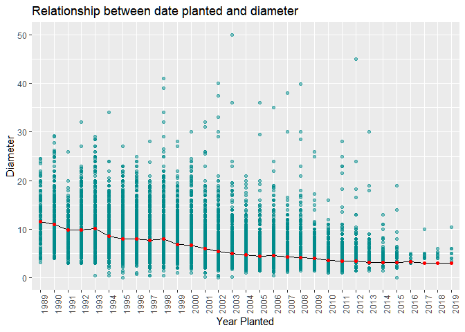
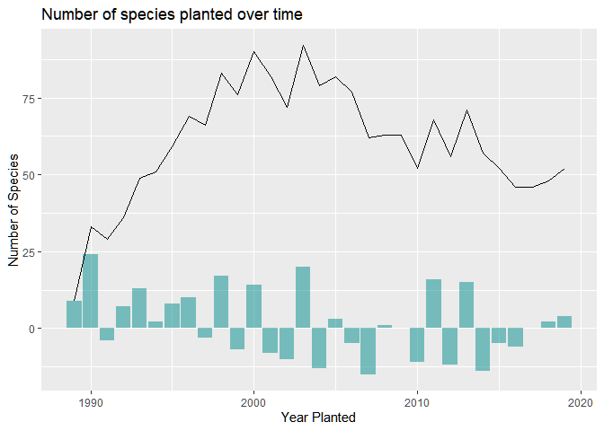
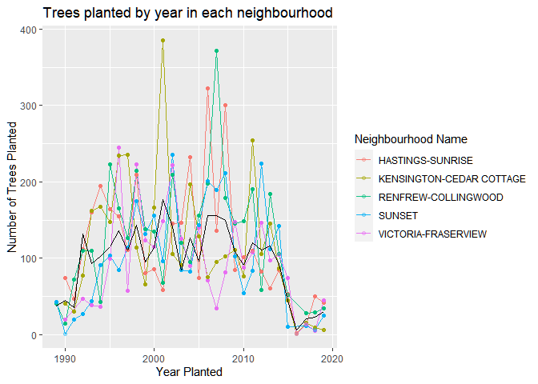
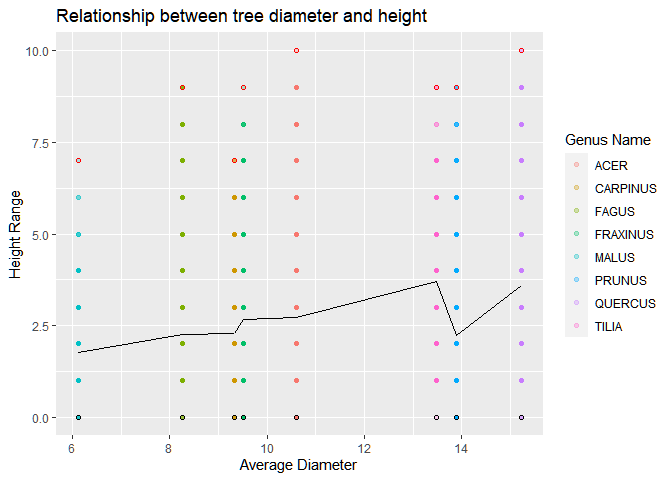

Mini Data Analysis Milestone 2
================

*To complete this milestone, you can either edit [this `.rmd`
file](https://raw.githubusercontent.com/UBC-STAT/stat545.stat.ubc.ca/master/content/mini-project/mini-project-2.Rmd)
directly. Fill in the sections that are commented out with
`<!--- start your work here--->`. When you are done, make sure to knit
to an `.md` file by changing the output in the YAML header to
`github_document`, before submitting a tagged release on canvas.*

# Welcome back to your mini data analysis project!

This time, we will explore more in depth the concept of *tidy data*, and
hopefully investigate further into your research questions that you
defined in milestone 1.

**NOTE**: The main purpose of the mini data analysis is to integrate
what you learn in class in an analysis. Although each milestone provides
a framework for you to conduct your analysis, it’s possible that you
might find the instructions too rigid for your data set. If this is the
case, you may deviate from the instructions – just make sure you’re
demonstrating a wide range of tools and techniques taught in this class.

Begin by loading your data and the tidyverse package below:

``` r
suppressMessages(library(datateachr))
suppressMessages(library(tidyverse))
suppressMessages(library(tibble))
suppressMessages(library(viridis))
suppressMessages(library(ggbreak))
```

# Learning Objectives

By the end of this milestone, you should:

-   Become familiar with manipulating and summarizing your data in
    tibbles using `dplyr` and `tidyr`, with a research question in mind.
-   Understand what *tidy* data is, and how to create it. In milestone
    3, we will explore when this might be useful.
-   Generate a reproducible and clear report using R Markdown.
-   Gain a greater understanding of how to use R to answer research
    questions about your data.

**Things to keep in mind**

-   Remember to document your code, be explicit about what you are
    doing, and write notes in this markdown document when you feel that
    context is required. Create your analysis as if someone else will be
    reading it! **There will be 2.5 points reserved for reproducibility,
    readability, and repo organization.**

-   Before working on each task, you should always keep in mind the
    specific **research question** that you’re trying to answer.

# Task 1: Process and summarize your data (15 points)

From milestone 1, you should have an idea of the basic structure of your
dataset (e.g. number of rows and columns, class types, etc.). Here, we
will start investigating your data more in-depth using various data
manipulation functions.

### 1.1 (2.5 points)

First, write out the 4 research questions you defined in milestone 1
were. This will guide your work through milestone 2:

<!-------------------------- Start your work below ---------------------------->

1.  Do trees that were planted earlier have larger diameters?

2.  Were certain species of trees planted more after a certain year?

3.  Did the planting of trees in Vancouver have a geographical change
    over time?

4.  What is the relationship between the tree diameter and height?
    <!----------------------------------------------------------------------------->

### 1.2 (10 points)

Now, for each of your four research questions, choose one task from
options 1-4 (summarizing), and one other task from 4-8 (graphing). You
should have 2 tasks done for each research question (8 total). Make sure
it makes sense to do them! (e.g. don’t use a numerical variables for a
task that needs a categorical variable.). Comment on why each task helps
(or doesn’t!) answer the corresponding research question.

Ensure that the output of each operation is printed!

**Summarizing:**

1.  Compute the *range*, *mean*, and *two other summary statistics* of
    **one numerical variable** across the groups of **one categorical
    variable** from your data.
2.  Compute the number of observations for at least one of your
    categorical variables. Do not use the function `table()`!
3.  Create a categorical variable with 3 or more groups from an existing
    numerical variable. You can use this new variable in the other
    tasks! *An example: age in years into “child, teen, adult, senior”.*
4.  Based on two categorical variables, calculate two summary statistics
    of your choosing.

**Graphing:**

5.  Create a graph out of summarized variables that has at least two
    geom layers.
6.  Create a graph of your choosing, make one of the axes logarithmic,
    and format the axes labels so that they are “pretty” or easier to
    read.
7.  Make a graph where it makes sense to customize the alpha
    transparency.
8.  Create 3 histograms out of summarized variables, with each histogram
    having different sized bins. Pick the “best” one and explain why it
    is the best.

Make sure it’s clear what research question you are doing each operation
for!

<!------------------------- Start your work below ----------------------------->

### Research Question 1: Do trees that were planted earlier have larger diameters?

To evaluate this question, I can start by extracting the years from the
*date\_planted* column and categorizing the data by treating teh years
as factors. Next, I calculate the mean diameters for each year.

``` r
trees_time_planted = vancouver_trees %>% 
  na.omit(date_planted) %>%
  mutate(year_planted=format(date_planted, format="%Y")) %>% 
  mutate(year_planted = factor(as.integer(year_planted))) %>% 
  arrange(year_planted) %>%
  group_by(year_planted) %>% 
  mutate(mean_dia_yr = mean(diameter))

print(trees_time_planted)
```

    ## # A tibble: 41,859 x 22
    ## # Groups:   year_planted [31]
    ##    tree_id civic_number std_street    genus_name species_name cultivar_name
    ##      <dbl>        <dbl> <chr>         <chr>      <chr>        <chr>        
    ##  1   30343         3621 W 30TH AV     PRUNUS     CERASIFERA   ATROPURPUREUM
    ##  2   30356         3727 W 30TH AV     PRUNUS     CERASIFERA   ATROPURPUREUM
    ##  3   30359         3749 W 30TH AV     PRUNUS     CERASIFERA   ATROPURPUREUM
    ##  4   83393         2888 HIGHBURY ST   PRUNUS     CERASIFERA   ATROPURPUREUM
    ##  5   38849         2198 W 41ST AV     PRUNUS     SERRULATA    KWANZAN      
    ##  6  121796         5003 BOUNDARY ROAD ACER       RUBRUM       RED SUNSET   
    ##  7  121800         5035 BOUNDARY ROAD ACER       RUBRUM       RED SUNSET   
    ##  8  121802         5053 BOUNDARY ROAD ACER       RUBRUM       RED SUNSET   
    ##  9  121808         5097 BOUNDARY ROAD ACER       RUBRUM       RED SUNSET   
    ## 10  121814         3692 WELLINGTON AV ACER       RUBRUM       RED SUNSET   
    ## # ... with 41,849 more rows, and 16 more variables: common_name <chr>,
    ## #   assigned <chr>, root_barrier <chr>, plant_area <chr>,
    ## #   on_street_block <dbl>, on_street <chr>, neighbourhood_name <chr>,
    ## #   street_side_name <chr>, height_range_id <dbl>, diameter <dbl>, curb <chr>,
    ## #   date_planted <date>, longitude <dbl>, latitude <dbl>, year_planted <fct>,
    ## #   mean_dia_yr <dbl>

``` r
#Summarizing 3. answered
```

Having all the data ready to plot. I can use a a point plot in ggplot to
display the diameters per year and overlay the mean diameters as a line
to check for a relationship.

``` r
plot_TimeVsDia =trees_time_planted %>% 
  ggplot()+
  geom_point(aes(year_planted,diameter), alpha = 0.5, colour = "cyan4") + 
  geom_line(aes(year_planted, mean_dia_yr, group = 1)) +
  geom_point(aes(year_planted, mean_dia_yr), colour = "red")+
  ylim(... = c(0, 50))+
  theme(axis.text.x = element_text(angle = 90)) + 
  xlab(label = "Year Planted") +
  ylab(label = "Diameter")+
  labs(title = "Relationship between date planted and diameter")

print(plot_TimeVsDia)
```

    ## Warning: Removed 11 rows containing missing values (geom_point).

<!-- -->

``` r
#Graphing 5 and 7 answered
```

Here, the black line is the mean diameter of trees over the years and
the red points are the values of the mean diameter for each year. Note:
I removed 11 observations contianing Outliers to improve the resolution
of the plot.

From the plot, there seems to be a small decrease in mean diameter as
the year of planting increases. This seems obvious as trees that were
planted later, would be younger and thus would be smaller. However,
looking at the overall diameters, the range of diameters seen is pretty
much identical and so the decrease in mean diameters does not seem
meaningful.

### Research Question 2: Were certain species of trees planted more after a certain year?

To look at this question first I need to modify the data table. First
again, I will extract the years from the *date\_planted* column. Next, I
will count the number of unique species and add them to a separate
column called *n\_spec*. Finally, I would also like to see the
increase/decrease of species in the current year as compared to the
previous year. To this I will create a new column called
*n\_spec\_prev\_year* which will contain values of *n\_spec* from the
previous year. Finally to calculate the change in number of species I
will subtract *n\_spec\_prev\_year* from *nspec* for each year.

``` r
species_num = vancouver_trees %>% 
  select(species_name, date_planted) %>% 
  na.omit(date_planted) %>%
  mutate(year_planted=as.integer(format(date_planted, format="%Y"))) %>% 
  group_by(year_planted) %>% 
  arrange(species_name, year_planted) %>%
  mutate(n_spec= length(unique(species_name))) %>% 
  arrange(year_planted) %>% 
  distinct(n_spec, .keep_all = TRUE) %>% 
  ungroup(year_planted) %>%
  mutate(n_spec_prev_year = append(0, n_spec[-length(n_spec)]), diff_spec = n_spec-n_spec_prev_year)

print(species_num)
```

    ## # A tibble: 31 x 6
    ##    species_name   date_planted year_planted n_spec n_spec_prev_year diff_spec
    ##    <chr>          <date>              <int>  <int>            <dbl>     <dbl>
    ##  1 BETULUS        1989-11-30           1989      9                0         9
    ##  2 ACERIFOLIA   X 1990-12-04           1990     33                9        24
    ##  3 ACERIFOLIA   X 1991-03-22           1991     29               33        -4
    ##  4 ACUTISSIMA     1992-11-04           1992     36               29         7
    ##  5 ACERIFOLIA   X 1993-09-14           1993     49               36        13
    ##  6 ACUTISSIMA     1994-11-17           1994     51               49         2
    ##  7 ACERIFOLIA   X 1995-05-03           1995     59               51         8
    ##  8 ACERIFOLIA   X 1996-11-06           1996     69               59        10
    ##  9 ACERIFOLIA   X 1997-03-14           1997     66               69        -3
    ## 10 ACERIFOLIA   X 1998-03-05           1998     83               66        17
    ## # ... with 21 more rows

``` r
#Summarizing 2 answered
```

To graph the date I will create a line plot which will show the number
of species planted each year. This will be overlaid by a column plot
that will show the increase/decrease of species over each year.

``` r
plot_SpecVsTime = species_num %>% 
  group_by(year_planted)%>% 
  ggplot() + geom_col(aes(year_planted, diff_spec), alpha = 0.5, fill="cyan4")+ 
  geom_line(aes(year_planted, n_spec))+
  scale_y_continuous(name = "Number of Species")+
  xlab(label = "Year Planted")+
  labs(title = "Number of species planted over time")

print(plot_SpecVsTime)
```

<!-- -->

``` r
#Graphing 5 answered 
```

Interestingly, from this plot we can see that in 1990 there were about 7
new species planted and 2003 was the year when most species were planted
in Vancouver.

This data shows that there was a change in the species of trees planted
from 1990 to 2019.

### Research Question 3: Did the planting of trees in Vancouver have a geographical change over time?

To look at the geographical change I will be looking at the
neighborhoods where the trees planted were recorded. First, I will
extract the years of the *date\_planted*. Next I will count the number
of trees planted per year in each neighborhood and put them in a new
column called *n\_planted*. I also looked at the average number of trees
planted per year and put this data in the column *avg\_tree\_pl\_year*.

``` r
trees_neigh = vancouver_trees %>% 
  na.omit(date_planted) %>%
  mutate(year_planted=as.integer(format(date_planted, format="%Y"))) %>%
  group_by(neighbourhood_name, year_planted) %>%
  mutate(n_planted = sum(complete.cases(year_planted))) %>%
  ungroup(neighbourhood_name) %>%
  mutate(avg_tree_pl_year = mean(n_planted)) %>% group_by(neighbourhood_name)

print(trees_neigh)
```

    ## # A tibble: 41,859 x 23
    ## # Groups:   neighbourhood_name [22]
    ##    tree_id civic_number std_street    genus_name species_name cultivar_name  
    ##      <dbl>        <dbl> <chr>         <chr>      <chr>        <chr>          
    ##  1  149556          494 W 58TH AV     ULMUS      AMERICANA    BRANDON        
    ##  2  149590          858 E 39TH AV     FRAXINUS   AMERICANA    AUTUMN APPLAUSE
    ##  3  149617         4909 SHERBROOKE ST ACER       PLATANOIDES  COLUMNARE      
    ##  4  149618         4925 SHERBROOKE ST ACER       PLATANOIDES  COLUMNARE      
    ##  5  149619         4969 SHERBROOKE ST ACER       PLATANOIDES  COLUMNARE      
    ##  6  149625          720 E 39TH AV     FRAXINUS   AMERICANA    AUTUMN APPLAUSE
    ##  7  149640         6968 SELKIRK ST    ACER       PLATANOIDES  COLUMNARE      
    ##  8  149673         5241 WINDSOR ST    FRAXINUS   OXYCARPA     RAYWOOD        
    ##  9  149683         7011 SELKIRK ST    ACER       PLATANOIDES  COLUMNARE      
    ## 10  149684         1223 W 54TH AV     ACER       PLATANOIDES  COLUMNARE      
    ## # ... with 41,849 more rows, and 17 more variables: common_name <chr>,
    ## #   assigned <chr>, root_barrier <chr>, plant_area <chr>,
    ## #   on_street_block <dbl>, on_street <chr>, neighbourhood_name <chr>,
    ## #   street_side_name <chr>, height_range_id <dbl>, diameter <dbl>, curb <chr>,
    ## #   date_planted <date>, longitude <dbl>, latitude <dbl>, year_planted <int>,
    ## #   n_planted <int>, avg_tree_pl_year <dbl>

``` r
# Summarizing 2 asnwered
```

In order to make informative yet not messy graphs I decided to look at
the 5 neighborhoods with the most number of trees planted. To look at
this, I extract the relevant columns from the previous data. Next, I
count the total number of trees recorded per neighbourhood by look at
the number of observations in *year\_planted* column per neighborhood.
Next the data is sorted by this count to obtain the neighbourhoods with
the most number of trees. I selected the first 5.

``` r
most_pop_neigh = trees_neigh %>%
  arrange(neighbourhood_name, year_planted,n_planted) %>% 
  select(neighbourhood_name, year_planted, n_planted) %>% 
  unique() %>% ungroup(year_planted) %>% 
  mutate(total_planted = sum(n_planted)) %>% 
  distinct(total_planted,.keep_all = TRUE) %>% 
  arrange(desc(total_planted)) %>% select(neighbourhood_name, total_planted)

head(most_pop_neigh, n=5)
```

    ## # A tibble: 5 x 2
    ## # Groups:   neighbourhood_name [5]
    ##   neighbourhood_name       total_planted
    ##   <chr>                            <int>
    ## 1 RENFREW-COLLINGWOOD               3762
    ## 2 HASTINGS-SUNRISE                  3490
    ## 3 KENSINGTON-CEDAR COTTAGE          3473
    ## 4 SUNSET                            3002
    ## 5 VICTORIA-FRASERVIEW               2741

Finally to plot the data, I first filter the data to only keep the
neighborhoods mentioned above. I created a line plot to show the number
of trees planted per year and grouped them by neighborhood. I also added
a second line plot with the average number of trees planted per year to
see if there was 1 neighbourhood that would be responsible to drive the
average up.

``` r
plot_neigh_time = trees_neigh %>% 
  filter(neighbourhood_name %in% most_pop_neigh$neighbourhood_name[1:5]) %>% 
  group_by(neighbourhood_name) %>% 
  ggplot(aes(colour = neighbourhood_name))+
  geom_line(aes(year_planted, n_planted, group = neighbourhood_name), alpha = 0.9) + 
  geom_point(aes(year_planted, n_planted), alpha = 0.3) + 
  geom_line(aes(year_planted, avg_tree_pl_year), colour = "black") + 
  xlab(label = "Year Planted") + 
  ylab(label = "Number of Trees Planted")+
  labs(title = "Trees planted by year in each neighbourhood", colour= "Neighbourhood Name")

print(plot_neigh_time)
```

<!-- -->

``` r
#Graphing 5 and 7 answered
```

The black line in the plot above shows the average number of trees
planted per year. Although the data looks messy, the information from
this graph is very simple. It seems like all neighbourhoods planted an
similar number of trees over the years and no neighbourhood particularly
stands out. However some information obtained from this graph shows that
Kensington-Cedar Cottage planted its highest number of trees in 2001 and
this was the highest in my data set too!. Similarly Renfrew-Collingwood
reached its planting peak in 2007.

Overall it does not seem like planting of trees in Vancouver had a
geographical change.

### Research Question 4: What is the relationship between the tree diameter and height?

Too answer this question I decided only to look at teh genus of trees
since I feel that on a species level, trees of the same genus may have
similar diameters and heights. I first calculated the mean diameter and
height for each genus. To look at more statistics I also calculated the
minimum, maximum and range of diameters and heights for each genus and
put them into relevant columns.

``` r
trees_dia_vs_height = vancouver_trees %>% 
  select(genus_name, diameter, height_range_id) %>% 
  group_by(genus_name) %>% 
  mutate(dia_mean = mean(diameter, na.rm=TRUE),
         dia_max = max(diameter),
         dia_min = min(diameter),
         dia_range = (dia_max - dia_min),
         height_mean = mean(height_range_id, na.rm=TRUE),
         height_max = max(height_range_id),
         height_min = min(height_range_id),
         height_range = height_max - height_min)

print(trees_dia_vs_height)
```

    ## # A tibble: 146,611 x 11
    ## # Groups:   genus_name [97]
    ##    genus_name diameter height_range_id dia_mean dia_max dia_min dia_range
    ##    <chr>         <dbl>           <dbl>    <dbl>   <dbl>   <dbl>     <dbl>
    ##  1 ULMUS          10                 2    22.8    144      1.25     143. 
    ##  2 ZELKOVA        10                 4     6.88    36      0.5       35.5
    ##  3 STYRAX          4                 3     4.10   435      0        435  
    ##  4 FRAXINUS       18                 4     9.51    97.5    0         97.5
    ##  5 ACER            9                 2    10.6    317      0        317  
    ##  6 PYRUS           5                 2     4.58    38      0.25      37.8
    ##  7 ACER           15                 3    10.6    317      0        317  
    ##  8 ACER           14                 3    10.6    317      0        317  
    ##  9 ACER           16                 2    10.6    317      0        317  
    ## 10 FRAXINUS        7.5               2     9.51    97.5    0         97.5
    ## # ... with 146,601 more rows, and 4 more variables: height_mean <dbl>,
    ## #   height_max <dbl>, height_min <dbl>, height_range <dbl>

``` r
#Summarizing 1 answered
```

In order to prevent messy and complicated plots I decided to only look
at the 8 genus with the most number of trees plotted. To obtain these
genus, I counted the number of trees in each genus and sorted this data
by the number of observations.

``` r
pop_genus = table(trees_dia_vs_height$genus_name) %>% 
  as_tibble(.name_repair = "minimal") %>% 
  rename(Genus_name = "") %>% 
  arrange(desc(n))

head(pop_genus, n=8)
```

    ## # A tibble: 8 x 2
    ##   Genus_name     n
    ##   <chr>      <int>
    ## 1 ACER       36062
    ## 2 PRUNUS     30683
    ## 3 FRAXINUS    7381
    ## 4 TILIA       6773
    ## 5 QUERCUS     6119
    ## 6 CARPINUS    5806
    ## 7 FAGUS       4808
    ## 8 MALUS       4173

To plot the data, I filtered the original dataset to only contain rows
with the genus mentioned above. Next I used a dot plot to plot average
diameters against heights of the trees. I also highlighted the minimum
and maximum heights in each group. Finally I overlaid a line plot
showing the mean heights which would show the relationship between the
height and diameter.

``` r
plot_DiaVsHeight = trees_dia_vs_height %>% 
  filter(genus_name %in% pop_genus$Genus_name[1:8]) %>% 
  arrange(dia_mean) %>% 
  ggplot(aes(dia_mean, height_range_id))+
  geom_point(aes(colour = genus_name), alpha= 0.3) + 
  geom_line(aes(dia_mean, height_mean)) + 
  geom_point(aes(dia_mean, height_max), colour = "red", pch=21) + 
  geom_point(aes(dia_mean, height_min), colour = "black", pch=21) + 
  xlab(label = "Average Diameter") + 
  ylab(label = "Height Range")+
  labs(title = "Relationship between tree diameter and height", colour = "Genus Name")

print(plot_DiaVsHeight)
```

<!-- -->

``` r
#Graphing 5 and 7 answered
```

In the plot above the minimum and maximum observations for each genus
are shown in black and red bordered dots respectively. The black line
shows the mean diameters according to the mean heights of the genus.

From this data it does not seem like there is a relationship between
height and diameter since trees of the genus *Prunus* have the second
highest mean diameters but do not have the second highest mean heights.
Perhaps including all genus recorded would lead to a more evident
relationship.

<!----------------------------------------------------------------------------->

### 1.3 (2.5 points)

Based on the operations that you’ve completed, how much closer are you
to answering your research questions? Think about what aspects of your
research questions remain unclear. Can your research questions be
refined, now that you’ve investigated your data a bit more? Which
research questions are yielding interesting results?

<!------------------------- Write your answer here ---------------------------->

1.  Do trees that were planted earlier have larger diameters? Although
    the data showed that trees planted earlier did have larger
    diameters, the difference was quite small to be conclusive. This can
    be seen in the large range of diameters seen every year which
    brought mean diameters for each year close to each other. Perhaps
    the certain genus or species could show a more conclusive
    relationship. A better question to ask would be:

**“Does the year of planting have an effect on the diameter on a
species-specific basis?”**

2.  Were certain species of trees planted more after a certain year?
    According to the graphs it seems like there was a change in the
    number of species planted every year and therefore requires more
    analysis to lead to a more conclusive answer. The analysis performed
    only showed that there was a difference in the number of species
    planted over the years but not the specific species. Here I feel
    that I am closer to the answer but not completely there yet. A more
    refined question in this case would be:

**“When did certain species of trees start getting planted and were
these stopped being planted after a certain year?”**

3.  Did the planting of trees in Vancouver have a geographical change
    over time? After looking at the data generated it seems that there
    isn’t a difference in the number of trees planted per year in the
    neighborhoods of Vancouver and that each neighborhood planted
    similar number of trees overall. However, my analysis only looked at
    5 neighbourhoods and there could be a difference if I included all
    the neighbourhoods. Perhaps there is a difference in which species
    were planted in each neighborhood over the years. A more specific
    question to ask would be:

**“Did some neighborhoods start planting trees of the genus *Acer* more
after 1989?”**

4.  What is the relationship between the tree diameter and height? From
    the data it seems that there is no meaningful relationship between
    height and diameter of the trees. However, this data was limited to
    the 5 most planted genus and there may be a relationship if all the
    genus were taken into account.

<!----------------------------------------------------------------------------->

# Task 2: Tidy your data (12.5 points)

In this task, we will do several exercises to reshape our data. The goal
here is to understand how to do this reshaping with the `tidyr` package.

A reminder of the definition of *tidy* data:

-   Each row is an **observation**
-   Each column is a **variable**
-   Each cell is a **value**

*Tidy’ing* data is sometimes necessary because it can simplify
computation. Other times it can be nice to organize data so that it can
be easier to understand when read manually.

### 2.1 (2.5 points)

Based on the definition above, can you identify if your data is tidy or
untidy? Go through all your columns, or if you have &gt;8 variables,
just pick 8, and explain whether the data is untidy or tidy.

<!--------------------------- Start your work below --------------------------->

``` r
vancouver_trees %>% select(std_street, genus_name, species_name, height_range_id, on_street,date_planted, longitude, latitude)
```

    ## # A tibble: 146,611 x 8
    ##    std_street    genus_name species_name height_range_id on_street     date_planted
    ##    <chr>         <chr>      <chr>                  <dbl> <chr>         <date>      
    ##  1 W 58TH AV     ULMUS      AMERICANA                  2 W 58TH AV     1999-01-13  
    ##  2 W 58TH AV     ZELKOVA    SERRATA                    4 W 58TH AV     1996-05-31  
    ##  3 WINDSOR ST    STYRAX     JAPONICA                   3 WINDSOR ST    1993-11-22  
    ##  4 E 39TH AV     FRAXINUS   AMERICANA                  4 E 39TH AV     1996-04-29  
    ##  5 WINDSOR ST    ACER       CAMPESTRE                  2 WINDSOR ST    1993-12-17  
    ##  6 W 61ST AV     PYRUS      CALLERYANA                 2 W 61ST AV     NA          
    ##  7 SHERBROOKE ST ACER       PLATANOIDES                3 SHERBROOKE ST 1993-12-16  
    ##  8 SHERBROOKE ST ACER       PLATANOIDES                3 SHERBROOKE ST 1993-12-16  
    ##  9 SHERBROOKE ST ACER       PLATANOIDES                2 SHERBROOKE ST 1993-12-16  
    ## 10 E 39TH AV     FRAXINUS   AMERICANA                  2 E 39TH AV     1993-12-03  
    ## # ... with 146,601 more rows, and 2 more variables: longitude <dbl>,
    ## #   latitude <dbl>

Based on the table above, I think *genus\_name*, *species\_name*,
**on\_street\_block**, *height\_range\_id*, *longitude* and, *latitude*
are all examples of tidy data since each column is 1 variable and each
cell is 1 value of that variable. But there are also instances of untidy
data, for example:

*date\_planted* : This column contains data in the date format but is
not tidy for analysis. I had to extract the year from the column every
time I wanted to run any time based analysis in my work and it should
have been divided into day, month and year.

*std\_street* : Here again it would be tidy’er to have separated the
street name and the street type to make for better analysis.

<!----------------------------------------------------------------------------->

### 2.2 (5 points)

Now, if your data is tidy, untidy it! Then, tidy it back to it’s
original state.

If your data is untidy, then tidy it! Then, untidy it back to it’s
original state.

Be sure to explain your reasoning for this task. Show us the “before”
and “after”.

<!--------------------------- Start your work below --------------------------->

Starting with the data seen above we can look at the data “as is”:

``` r
untidy_data = vancouver_trees %>% 
  select(std_street, genus_name, species_name, height_range_id, on_street,date_planted, longitude, latitude)

print(untidy_data)
```

    ## # A tibble: 146,611 x 8
    ##    std_street    genus_name species_name height_range_id on_street     date_planted
    ##    <chr>         <chr>      <chr>                  <dbl> <chr>         <date>      
    ##  1 W 58TH AV     ULMUS      AMERICANA                  2 W 58TH AV     1999-01-13  
    ##  2 W 58TH AV     ZELKOVA    SERRATA                    4 W 58TH AV     1996-05-31  
    ##  3 WINDSOR ST    STYRAX     JAPONICA                   3 WINDSOR ST    1993-11-22  
    ##  4 E 39TH AV     FRAXINUS   AMERICANA                  4 E 39TH AV     1996-04-29  
    ##  5 WINDSOR ST    ACER       CAMPESTRE                  2 WINDSOR ST    1993-12-17  
    ##  6 W 61ST AV     PYRUS      CALLERYANA                 2 W 61ST AV     NA          
    ##  7 SHERBROOKE ST ACER       PLATANOIDES                3 SHERBROOKE ST 1993-12-16  
    ##  8 SHERBROOKE ST ACER       PLATANOIDES                3 SHERBROOKE ST 1993-12-16  
    ##  9 SHERBROOKE ST ACER       PLATANOIDES                2 SHERBROOKE ST 1993-12-16  
    ## 10 E 39TH AV     FRAXINUS   AMERICANA                  2 E 39TH AV     1993-12-03  
    ## # ... with 146,601 more rows, and 2 more variables: longitude <dbl>,
    ## #   latitude <dbl>

Next I will separate the data\_planted into columns “year”, “month” and,
“day”. Separating this column will help to run analyses by year or even
round the years into decades and run the analyses by decade which was
not possible earlier.  
I will also separate std\_street into “Street Direction”, “Street Name”
and, “Street Type”. This again will help to run analyses answering
questions such as “Do trees planted on streets facing East reach higher
diameters?”.

``` r
tidy_data = untidy_data %>% 
  separate(date_planted, into = c("year", "month", "day"), sep = "-") %>%
  separate(std_street, into = c("Street Direction","Street Name", "Street Type"), sep = " ", fill = "left")
```

    ## Warning: Expected 3 pieces. Additional pieces discarded in 2010 rows [24, 31,
    ## 32, 58, 59, 60, 84, 108, 138, 142, 143, 341, 379, 380, 381, 429, 430, 431, 439,
    ## 697, ...].

``` r
print(tidy_data)
```

    ## # A tibble: 146,611 x 12
    ##    `Street Direction` `Street Name` `Street Type` genus_name species_name
    ##    <chr>              <chr>         <chr>         <chr>      <chr>       
    ##  1 W                  58TH          AV            ULMUS      AMERICANA   
    ##  2 W                  58TH          AV            ZELKOVA    SERRATA     
    ##  3 <NA>               WINDSOR       ST            STYRAX     JAPONICA    
    ##  4 E                  39TH          AV            FRAXINUS   AMERICANA   
    ##  5 <NA>               WINDSOR       ST            ACER       CAMPESTRE   
    ##  6 W                  61ST          AV            PYRUS      CALLERYANA  
    ##  7 <NA>               SHERBROOKE    ST            ACER       PLATANOIDES 
    ##  8 <NA>               SHERBROOKE    ST            ACER       PLATANOIDES 
    ##  9 <NA>               SHERBROOKE    ST            ACER       PLATANOIDES 
    ## 10 E                  39TH          AV            FRAXINUS   AMERICANA   
    ## # ... with 146,601 more rows, and 7 more variables: height_range_id <dbl>,
    ## #   on_street <chr>, year <chr>, month <chr>, day <chr>, longitude <dbl>,
    ## #   latitude <dbl>

Finally, I will untidy the data back to what it was

``` r
untidied_data = tidy_data %>%
  unite(col="year_planted", c(year, month, day), sep="-", na.rm=FALSE) %>%
  unite(col="std_street", c(`Street Direction`,`Street Name`, `Street Type`), sep = " ", na.rm = TRUE)

print(untidied_data)
```

    ## # A tibble: 146,611 x 8
    ##    std_street    genus_name species_name height_range_id on_street     year_planted
    ##    <chr>         <chr>      <chr>                  <dbl> <chr>         <chr>       
    ##  1 W 58TH AV     ULMUS      AMERICANA                  2 W 58TH AV     1999-01-13  
    ##  2 W 58TH AV     ZELKOVA    SERRATA                    4 W 58TH AV     1996-05-31  
    ##  3 WINDSOR ST    STYRAX     JAPONICA                   3 WINDSOR ST    1993-11-22  
    ##  4 E 39TH AV     FRAXINUS   AMERICANA                  4 E 39TH AV     1996-04-29  
    ##  5 WINDSOR ST    ACER       CAMPESTRE                  2 WINDSOR ST    1993-12-17  
    ##  6 W 61ST AV     PYRUS      CALLERYANA                 2 W 61ST AV     NA-NA-NA    
    ##  7 SHERBROOKE ST ACER       PLATANOIDES                3 SHERBROOKE ST 1993-12-16  
    ##  8 SHERBROOKE ST ACER       PLATANOIDES                3 SHERBROOKE ST 1993-12-16  
    ##  9 SHERBROOKE ST ACER       PLATANOIDES                2 SHERBROOKE ST 1993-12-16  
    ## 10 E 39TH AV     FRAXINUS   AMERICANA                  2 E 39TH AV     1993-12-03  
    ## # ... with 146,601 more rows, and 2 more variables: longitude <dbl>,
    ## #   latitude <dbl>

<!----------------------------------------------------------------------------->

### 2.3 (5 points)

Now, you should be more familiar with your data, and also have made
progress in answering your research questions. Based on your interest,
and your analyses, pick 2 of the 4 research questions to continue your
analysis in milestone 3, and explain your decision.

Try to choose a version of your data that you think will be appropriate
to answer these 2 questions in milestone 3. Use between 4 and 8
functions that we’ve covered so far (i.e. by filtering, cleaning,
tidy’ing, dropping irrelvant columns, etc.).

<!--------------------------- Start your work below --------------------------->

After thinking about the data more, I have decided to continue working
on research questions 1 and 2:

1.  Do trees that were planted earlier have larger diameters? I want to
    answer this question because I feel that grouping the data according
    to genus or species has potential to show a relationship between
    year planted and diameters.I am interested in this question and I
    would like to pursue this to the end. There is also a possibility
    that I could find a relationship such that after a certain year
    there would no affect on the diameter notwithstanding the age of the
    tree.

2.  Were certain species of trees planted more after a certain year? I
    feel that my analysis here was almost complete and only requires
    refining as well a bit of modifying. This question still remains
    unanswered and I am interested in the results which could show
    trends in tree planting of the residents of Vancouver.

For the next set of analyses I will tidy *vancouver\_trees* and clean it
up so that it is more usable downstream

``` r
tidy_trees = vancouver_trees %>% 
  filter(!is.na(date_planted)) %>%
  separate(date_planted, into = c("year","month", "day"), sep = "-") %>%
  mutate(year = as.integer(year), month = as.integer(month), day = as.integer(day))%>%
  rename(genus = genus_name, species = species_name, neighbourhood = neighbourhood_name, height_range = height_range_id) %>%
  select(genus, species, neighbourhood, diameter, height_range, year)

print(tidy_trees)
```

    ## # A tibble: 70,063 x 6
    ##    genus    species      neighbourhood            diameter height_range  year
    ##    <chr>    <chr>        <chr>                       <dbl>        <dbl> <int>
    ##  1 ULMUS    AMERICANA    MARPOLE                     10               2  1999
    ##  2 ZELKOVA  SERRATA      MARPOLE                     10               4  1996
    ##  3 STYRAX   JAPONICA     KENSINGTON-CEDAR COTTAGE     4               3  1993
    ##  4 FRAXINUS AMERICANA    KENSINGTON-CEDAR COTTAGE    18               4  1996
    ##  5 ACER     CAMPESTRE    KENSINGTON-CEDAR COTTAGE     9               2  1993
    ##  6 ACER     PLATANOIDES  KENSINGTON-CEDAR COTTAGE    15               3  1993
    ##  7 ACER     PLATANOIDES  KENSINGTON-CEDAR COTTAGE    14               3  1993
    ##  8 ACER     PLATANOIDES  KENSINGTON-CEDAR COTTAGE    16               2  1993
    ##  9 FRAXINUS AMERICANA    KENSINGTON-CEDAR COTTAGE     7.5             2  1993
    ## 10 TILIA    EUCHLORA   X KENSINGTON-CEDAR COTTAGE     7.75            2  1993
    ## # ... with 70,053 more rows

<!----------------------------------------------------------------------------->

*When you are done, knit an `md` file. This is what we will mark! Make
sure to open it and check that everything has knitted correctly before
submitting your tagged release.*

### Attribution

Thanks to Victor Yuan for mostly putting this together.
